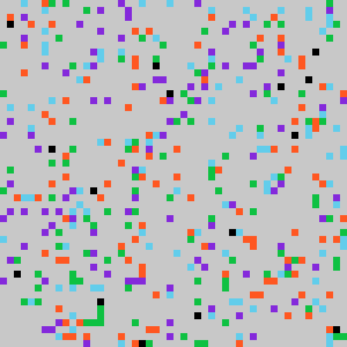
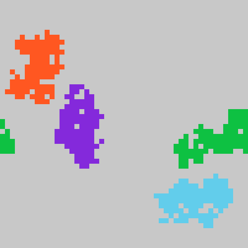
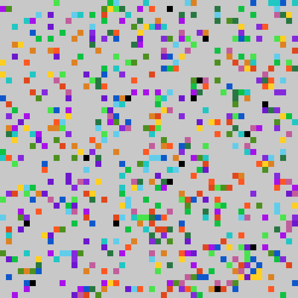
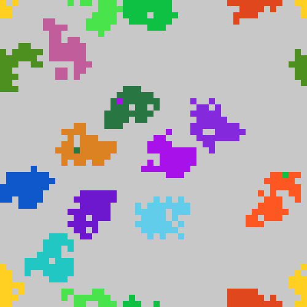

# Ant Clustering Algorithm

## Ant clustering simulation implemented in Rust

### Heterogeneous Data Branch (Grains)

This branch focuses on simulating ant clustering with heterogeneous data, represented by grains of different size and weight. For the version handling homogeneous data, please visit the [main branch](../../tree/main).

#### Usage

To execute the simulation, use the cargo tool. It's recommended to compile and/or run the release version due to the complexity of the project. You can use default parameters for the simulation or pass custom parameters during execution.

#### Examples

```bash
cargo run --release
```
or
\
\
`
cargo run --release <input_file> <ant_vision> <rows> <cols> <alive_ants> <iterations> <k1> <k2> <alpha>
`
\
Replacing `<input_file>`, `<ant_vision>`, `<rows>`, `<cols>`, `<alive_ants>`, `<iterations>`, `<k1>`, `<k2>`, and `<alpha>` with appropriate values according to your requirements.

```
cargo run --release "input/4_groups.txt" 1 50 50 10 4000000 0.35 0.65 13.0
```






