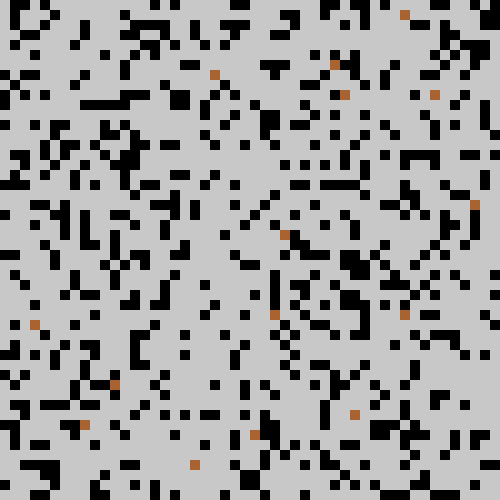
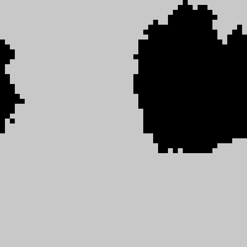
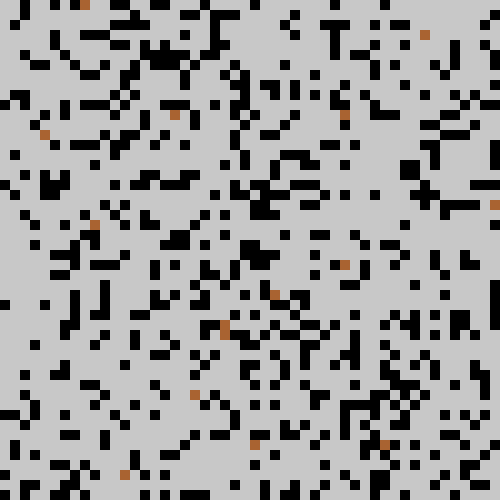
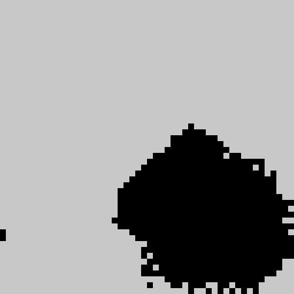
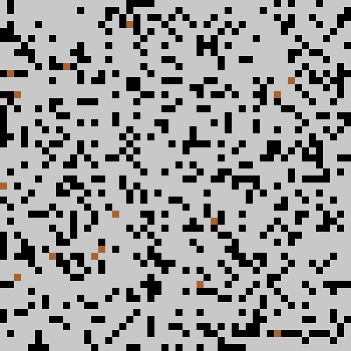
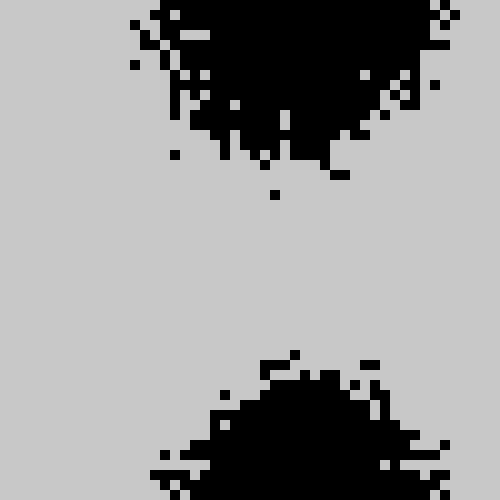

# Ant Clustering Algorithm

## Ant clustering simulation implemented in Rust

### Homogeneous Data Branch (Dead Ants)

This branch focuses on simulating ant clustering with homogeneous data, represented by dead ants. For the version handling heterogeneous data, please visit the [data-clustering branch](../../tree/data-clustering).

#### Usage

To execute the simulation, use the cargo tool. It's recommended to compile and/or run the release version due to the complexity of the project. You can use default parameters for the simulation or pass custom parameters during execution.

#### Examples

```bash
cargo run --release
```
or
`
cargo run --release <dir_name_for_result> <ant_vision> <rows> <cols> <alive_ants> <dead_ants> <iterations>
`
Replacing `<dir_name_for_result>`, `<ant_vision>`, `<rows>`, `<cols>`, `<alive_ants>`, `<dead_ants>`, and `<iterations>` with appropriate values according to your requirements.

```
cargo run --release "results" 1 100 100 150 3000 1000000
```









